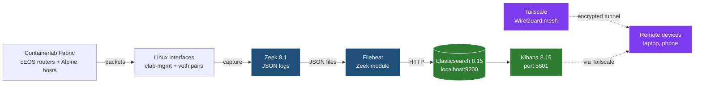
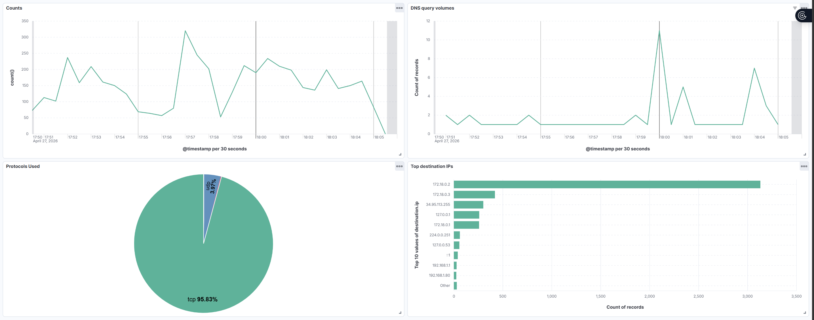

# Phase 4 — Security & Observability (Zeek + ELK + Tailscale)

Network observability and zero-trust remote access on top of the EVPN fabric. Three independent components compose into a complete monitoring + access stack:

- **Zeek** — passive network sensor producing structured JSON logs of every connection observed on the lab VM
- **ELK Stack** (Elasticsearch + Filebeat + Kibana) — log ingestion, indexing, and visualization
- **Tailscale** — zero-trust mesh VPN providing encrypted remote access from any network

## Architecture



## Component 1 — Zeek

Zeek monitors all network interfaces on the lab VM (`interface=any` in `node.cfg`) and produces structured JSON logs in `/opt/zeek/logs/current/`. JSON output is enabled via `@load policy/tuning/json-logs.zeek` in `local.zeek`.

Logs produced include:
- `conn.log` — every TCP/UDP/ICMP connection summarized
- `dns.log` — every DNS query and response
- `weird.log` — protocol anomalies (encapsulated VXLAN traffic generates entries here, since Zeek's default decoder doesn't auto-parse VXLAN inner packets)
- `notice.log` — security-relevant events
- `capture_loss.log` — packet capture loss tracking

Started as a service via `zeekctl deploy` and kept running across reboots.

## Component 2 — ELK Stack

Deployed via Docker Compose at `/home/labadmin/elk-stack/docker-compose.yml`:

- **Elasticsearch 8.15** — bound to `127.0.0.1:9200` for safety (security off in single-node config), 1 GiB JVM heap, persistent named volume for data
- **Kibana 8.15** — bound to `0.0.0.0:5601` so reachable from LAN and over Tailscale
- **Filebeat 8.x** — installed on the host (not Docker), Zeek module enabled with custom paths pointing at `/opt/zeek/logs/current/`

The Kibana dashboard `Network Observability — Phase 4` includes:
- Connection volume over time (line chart)
- Top destination IPs (bar chart) — surfaces "top talkers" on the network
- Protocol distribution (pie chart) — TCP/UDP ratio
- DNS query volume over time (line chart, filtered by `event.dataset: zeek.dns`)

## Component 3 — Tailscale

Installed on the lab VM via the official one-liner. Authenticated via GitHub OAuth into a personal tailnet. The lab VM has a permanent Tailscale IP (`100.x.y.z` in CGNAT space) reachable from any other device on the same tailnet — laptop, phone, or any other endpoint — regardless of physical network.

Use cases demonstrated:
- SSH to lab VM over cellular network from a laptop
- Browse Kibana dashboard from a phone on cellular data
- All traffic end-to-end encrypted via WireGuard

Replaces traditional port-forwarding + dynamic DNS or full-tunnel VPN setups with identity-based access.

## Bridge name reservation

To make Zeek and other tools predictable, the Containerlab management bridge is now pinned to a stable name. In `evpn-fabric.clab.yml`:

```yaml
mgmt:
  network: clab-mgmt
  bridge: clab-mgmt
  ipv4-subnet: 172.20.20.0/24
```

Without this, Containerlab generates a random bridge name (`br-27fc9a195e28`) on every redeploy, which would break any tool that referenced it.

## Resource requirements

The full Phase 4 stack requires more memory than Phases 1-3:
- cEOS containers: ~4 GiB
- Elasticsearch: ~1.5 GiB (1 GiB heap + overhead)
- Kibana: ~500 MiB
- Zeek + Filebeat + Tailscale: <500 MiB

The lab VM was resized from 8 GiB / 4 cores to **12 GiB / 6 cores** via Terraform (in-place change, no recreation). This was a one-line Terraform diff demonstrating the value of IaC: capacity changes are reproducible and reviewable.

## Lessons learned

- **Zeek's default capture interface choice matters.** Pointing at the management bridge missed all data-plane traffic, since inter-container links use direct veth pairs. `interface=any` captures everything regardless of topology.
- **VXLAN encapsulation hides inner traffic from default Zeek configs.** Host-to-host VXLAN traffic between leaves is logged at the outer (UDP/4789) level, not the inner (10.100.100.x) level. Decoding inner VXLAN payloads requires explicit Zeek configuration; out of scope for this lab.
- **Filebeat needs root or zeek-group membership** to read Zeek logs (`/opt/zeek/logs/current/` is `drwxr-sr-x root:zeek`). Default Filebeat install runs as root, which works. Non-root deployments would need `usermod -a -G zeek filebeat`.
- **Elasticsearch in single-node mode requires 0 replicas** in the Filebeat template settings — otherwise indices stay yellow forever waiting for replica shards that can never be allocated.
- **Tailscale's free tier is more than sufficient for a homelab** — 100 devices, no time limits, all features. The login.tailscale.com admin console makes device management trivial.
